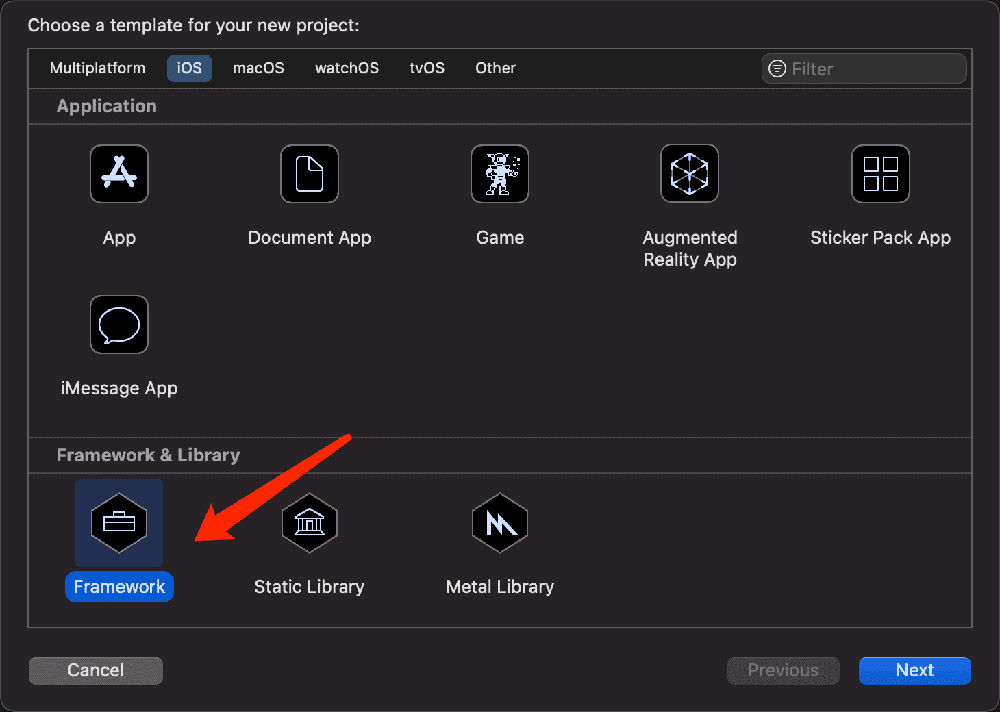
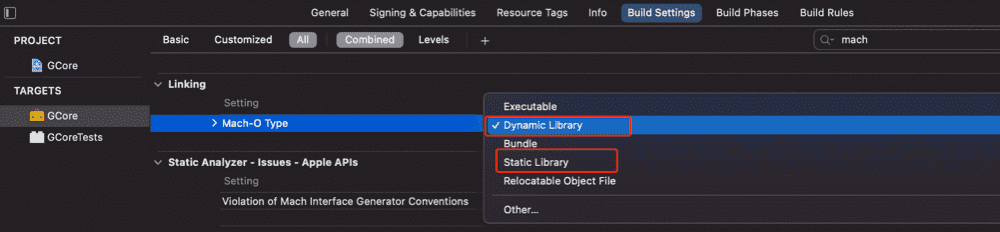
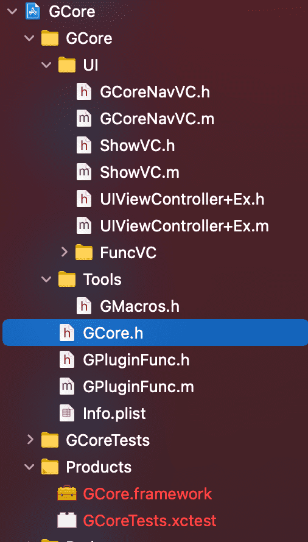
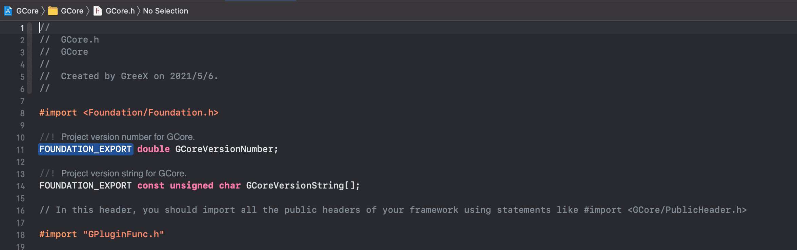

# iOS动态库实现插件化

### 1、动态库制作



选择**Framework**，创建动态库。

**Framework**分*动态*、*静态*两种，可以通过下面路径查看

> TARGETS->Build Settings（搜索mach-o）->Mach-O Type



### 2、代码编写



本例创建动态库的名字为GCore，项目会自动生成一个名为GCore.h的头文件



其中可导入你想用的头文件。
UI文件夹下为demo实现的简单页面，大家可自定义自己的UI界面或功能。代码写完后，可在路径**TARGETS->Build Phases->Headers**下将你需要暴露给外面调用的头文件添加到**Public**下面即可

### 3、动态库编译

编译很简单，正常的**Command + B**快捷键、Xcode右上角编译按钮均可实现编译，编译完成后，即可在**Products**目录下面看到红色的**GCore.framework**变成正常颜色了，右击选择**Show in Finder**即可找到你编译的动态库。

##### 注意点

1. 动态库编译的时候注意选择模拟器还是真机(Any iOS Device)；

2. 注意release和debug状态；

3. 动态库支持的最低版本号；

4. 资源文件使用bundle文件包裹(本项目为GCore.bundle)，并注意资源文件使用路径，如本项目图片调用

    ```
    // kBundlePath为GCore.bundle的路径，可以使沙盒路径，也可以是NSBundle路径，imageName为图片名称，
    [UIImage imageNamed:[NSString stringWithFormat:@"%@/%@", kBundlePath, imageName]];
    ```
    
5. 系统在加载动态库时，会检查Framework的签名，签名中必须包含TeamIdentifier，并且Framework和主App的TeamIdentifier必须一致，***模拟器测试可忽略***；

6. 目前而言，Apple并不希望开发者绕过App Store来更新App，因此需谨慎对待插件化的使用，对于不需要上架的企业级应用，是可以使用的。 

### 4、动态库实现插件化

将之前编译好的动态库放入服务器方便下载，然后在项目中下载并使用

1. 使用AFNetworking下载动态库到沙盒，并用SSZipArchive解压（注意解压路径）

   ```
   /// 下载并解压
   - (IBAction)downloadPlugInAction:(id)sender {
       NSString *frameworkPath = [NSString stringWithFormat:@"%@/Documents/", NSHomeDirectory()];
       if ([[NSFileManager defaultManager] fileExistsAtPath:[frameworkPath stringByAppendingPathComponent:@"GCore.zip"]]){
           [[NSFileManager defaultManager] removeItemAtPath:[frameworkPath stringByAppendingPathComponent:@"GCore.zip"] error:nil];
       }
       
       AFHTTPSessionManager *manager = [self createAFHTTPSessionManager];
       
       NSString *url = @"http://localhost/GCore.zip";
       NSURLRequest *request = [NSURLRequest requestWithURL:[NSURL URLWithString:url]];
       
       NSURLSessionDownloadTask *downloadTask = [manager downloadTaskWithRequest:request progress:^(NSProgress * _Nonnull downloadProgress) {
           NSLog(@"progress = %@", downloadProgress);
       } destination:^NSURL * _Nonnull(NSURL * _Nonnull targetPath, NSURLResponse * _Nonnull response) {
           NSString *filePath = [NSString stringWithFormat:@"%@/Documents/GCore.zip", NSHomeDirectory()];
           return [NSURL fileURLWithPath:filePath];
       } completionHandler:^(NSURLResponse * _Nonnull response, NSURL * _Nullable filePath, NSError * _Nullable error) {
           NSLog(@"下载完成");
           
           NSString *errMsg = @"";
           if (error == nil) {
               //删除原有库
               NSString *frameworkPath = [NSString stringWithFormat:@"%@/Documents/", NSHomeDirectory()];
               if ([[NSFileManager defaultManager] fileExistsAtPath:[frameworkPath stringByAppendingPathComponent:@"GCore.framework"]]){
                   [[NSFileManager defaultManager] removeItemAtPath:[frameworkPath stringByAppendingPathComponent:@"GCore.framework"] error:nil];
               }
               if ([[NSFileManager defaultManager] fileExistsAtPath:[frameworkPath stringByAppendingPathComponent:@"GCore.bundle"]]){
                   [[NSFileManager defaultManager] removeItemAtPath:[frameworkPath stringByAppendingPathComponent:@"GCore.bundle"] error:nil];
               }
               
               //解压库
               NSString *zipPath = [NSString stringWithFormat:@"%@/Documents/GCore.zip", NSHomeDirectory()];
               BOOL res = [SSZipArchive unzipFileAtPath:zipPath toDestination:frameworkPath];
               if (res) {
                   errMsg = @"下载并解压成功";
               } else {
                   errMsg = @"下载但解压失败";
               }
               NSLog(@"frameworkPath = %@", frameworkPath);
           } else {
               errMsg = @"下载失败";
           }
           
           UIAlertView *alertView = [[UIAlertView alloc] initWithTitle:errMsg message:nil delegate:nil cancelButtonTitle:nil otherButtonTitles:@"确定", nil];
           [alertView show];
       }];
       [downloadTask resume];
   }
   ```

2. 使用**[NSBundle bundleWithPath:frameworkPath]**将之前下载好的动态库加载到内存

   ```
   //使用NSBundle实现加载
   - (IBAction)loadPlugInAction:(id)sender {
       NSString *frameworkPath = [NSString stringWithFormat:@"%@/Documents/GCore.framework", NSHomeDirectory()];
       NSError *err = nil;
       NSBundle *bundle = [NSBundle bundleWithPath:frameworkPath];
       NSString *str = @"加载动态库失败!";
       if ([bundle loadAndReturnError:&err]) {
           NSLog(@"bundle load framework success.");
           str = @"加载动态库成功!";
       } else {
           NSLog(@"bundle load framework err:%@",err);
       }
       
       UIAlertView *alertView = [[UIAlertView alloc] initWithTitle:str message:nil delegate:nil cancelButtonTitle:nil otherButtonTitles:@"确定", nil];
       [alertView show];
   }
   
   
   //使用dlopen实现加载
   - (IBAction)loadPlugInAction:(id)sender {
   		NSString *documentsPath = [NSString stringWithFormat:@"%@/Documents/GCore.framework/GCore",NSHomeDirectory()];
   		[self dlopenLoadDylibWithPath:documentsPath];
       if (dlopen([path cStringUsingEncoding:NSUTF8StringEncoding], RTLD_NOW) == NULL) { 
           char *error = dlerror(); 
           NSLog(@"dlopen error: %s", error); 
       } else { 
           NSLog(@"dlopen load framework success."); 
    		} 
   }
   ```

3. 接下来就是动态库调用了

   ```
   - (IBAction)plugInAction:(id)sender {
       Class GPluginFunc = NSClassFromString(@"GPluginFunc");
       if(GPluginFunc){
           UIViewController *ctrl = [GPluginFunc performSelector:@selector(showUI)];
           [self presentViewController:ctrl animated:true completion:nil];
       } else {
           UIAlertView *alertView = [[UIAlertView alloc] initWithTitle:@"调用方法失败!" message:nil delegate:nil cancelButtonTitle:nil otherButtonTitles:@"确定", nil];
           [alertView show];
       }
   }
   ```

如此，一个简单的动态库实现插件化的工作算完成了。

### 5、Mac本地服务实现下载

如果无条件试下服务器实现下载功能，可用Mac本实现本地

1. 首先mac自带apache服务，我们只需要在终端输入下面命令将服务打开即可

   ```
   sudo apachectl start
   ```

   启动后在浏览器访问[http://localhost](http://localhost/) 就可以看到效果

2. apache服务默认目录在**/Library/WebServer/Documents**，只需要将动态库放入该目录并访问对应URL即可实现下载。比如本demo就是将动态库和bundle资源文件压缩成GCore.zip放入该目录下面，只需浏览器访问*http://localhost/GCore.zip*即可下载，如果使用真机测试，在同一网络下面，可将localhost缓存Mac的网路IP地址即可。

3. apache其他命令

   ```
   //关闭服务
   sudo apachectl stop
   //重启服务
   sudo apachectl restart
   ```

   


